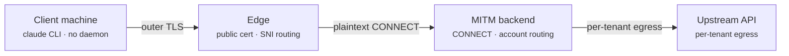

# Hosted service — requirements

Requirements for turning the local proxy into a multi-tenant hosted service.

Every architectural claim below is **measured**, not assumed: a real Claude Code process
was driven through a proxy and the handshakes and request paths were observed. Findings
are numbered `F01`–`F18` and referenced from the requirements that rest on them. What
could not be measured is recorded as open rather than filled in with a guess.

| | |
| --- | --- |
| Requirements | 18 functional, 21 non-functional — §4.1, §4.2 |
| Assumptions | 14 — 6 verified, 7 unverified, 1 known false — §4.3 |
| Constraints | 10 — §4.4 |
| Measured findings | 18 — §2 |
| Backlog | 1 — egress IP, §5 |
| Tracked as issues | [#3](../../issues/3)–[#9](../../issues/9) |
| Pull requests | [#1](../../pull/1), [#2](../../pull/2), [#10](../../pull/10) |

---

## 0. Purpose and goals

### Purpose

Let one person use **their own** Claude accounts from **their own** machines without
installing and maintaining a proxy on each one. The local proxy already pools accounts;
this moves that pooling somewhere central so several machines share it.

### Non-goals

Stated so requirements are not written for them.

- **No billing.** The service is not sold. Funding, if any, is donations.
- **No schedule.** It ships when it is finished; no dates are estimated, so nothing here is
  scoped down to hit one.
- **Not a way to get more quota than the accounts hold.** The product redistributes what
  the accounts already have — see CON-07.

### Two deployment modes

These have very different obligations, and several requirements apply to only one.

**Decided: community-hosted is the target.** Self-hosted is not a fallback — it is the
first milestone on the way there (M1, §6). Everything M1 delivers is needed by the
community-hosted build too; nothing is thrown away. The value of sequencing it that way is
that the project reaches something usable, by its own author, before it takes on anyone
else's credentials.

| | **Self-hosted** | **Community-hosted** |
| --- | --- | --- |
| Who operates it | The account owner | A volunteer, for others |
| Whose credentials it holds | The operator's own | Other people's |
| Multi-tenancy | Optional | Required |
| Per-tenant CA, KMS, audit logging | Optional | Required |
| Privacy policy, DPA, incident process | Not applicable | Required |
| Credential-custody grey area (CON-06) | **Does not arise** | Applies |
| Funding for dedicated egress, KMS, on-call | Operator's own machine | **Donations only** |

The local proxy already supports off-box operation (F13), so M1 is a short distance from
what exists. Community-hosted then adds the control plane, the security boundary, and the
legal exposure — funded by donations.

That funding gap is a real constraint, not a footnote (CON-08). Several requirements here
— per-tenant egress IPs (NFR-08), KMS-held CA keys (NFR-03), incident response (NFR-15) —
carry ongoing cost with no revenue against them. Reaching M1 first means that question can
be answered with a running system rather than an estimate.

### Success criteria

What "finished" means. Each is checkable.

| | Criterion |
| --- | --- |
| **G-1** | A machine is enrolled and `claude` works with **no resident process** on it |
| **G-2** | Every request that spends quota is attributed to the account that served it |
| **G-3** | No request is ever served with an account belonging to a different person |
| **G-4** | A device can be revoked without disturbing that person's other devices |
| **G-5** | Pooling *N* accounts yields materially more headroom than one — the premise (ASM-09 is the open risk) |
| **G-6** | When the service is unreachable, the failure is legible and recovery does not need the operator |

G-6 is the one with no requirement behind it today; see NFR-12 and NFR-13.

## 1. Scope

Each user registers **accounts they own** and uses them from their own machines. Accounts
are not shared between people. The proxy runs in the cloud and terminates MITM there.

The client carries **no resident process** — three files and one settings block. No agent,
no shell wrapper, no system trust-store installation. This was measured, not assumed.

| On the client | Role |
| --- | --- |
| `tenant-ca.pem` | Trusts the inner MITM leaf |
| `device.crt` / `device.key` | Device identity — per-machine auth and revocation |
| `~/.claude/settings.json` | `env` block holding the proxy URL and the paths above |

> **The outer TLS can use an ordinary public certificate.** When the edge terminates
> outer TLS with a publicly-trusted certificate, the device certificate inside the CONNECT
> tunnel still reaches the backend (F08). So the only CA a client must be given is the
> **inner** one.

---

## 2. Measured findings

| ID | Question | Result | Environment |
| --- | --- | --- | --- |
| **F01** | Does the client present a certificate on the TLS handshake *inside* the CONNECT tunnel? | **Yes** — `CN=device-01` observed on `POST /v1/messages` | 2.1.223, 2.1.193 |
| **F02** | Is an `https://` scheme proxy URL supported? | **Yes** — outer TLS → CONNECT → inner TLS all succeed | 2.1.223, 2.1.193 |
| **F03** | What actually causes the reported `https://` proxy failure? | **Misdiagnosis** — not TLS-in-TLS; the proxy certificate lacked the connect hostname in its SAN | Windows |
| **F04** | Can the proxy be configured purely from the `env` block of `settings.json`? | **Yes** — no shell variables, no wrapper | project scope |
| **F05** | Can 100% of traffic be captured from `settings.json` alone? | **No** — one `/api/eval/*` request fires before settings load and bypasses the proxy. Superseded by F14 | isolated by experiment |
| **F06** | Does mTLS coverage vary by client version? | **Yes** — 2.1.193 omits it on bootstrap paths, but **both** versions send it on `/v1/messages` | 2.1.223 vs 2.1.193 |
| **F07** | Cost of an nginx `stream` passthrough in front? | **None** — 5.00 s vs 5.01 s direct | Linux |
| **F08** | Does device mTLS survive an edge that terminates the outer TLS? | **Yes** — public cert at the edge, plaintext CONNECT to the backend, certificate still arrives | Linux, public path |
| **F09** | Is refusing a non-upstream CONNECT safe? | **For telemetry hosts, yes** — the client carried on. Does **not** extend to every host: `downloads.claude.ai` carries plugin and self-update traffic and was never part of that test | 2.1.223 |
| **F10** | How much traffic gets an account token injected today? | **Too much** — 8 of 12 observed paths, including account-scoped state | live capture |
| **F11** | Does Linux behave differently from Windows? | **No** — identical results | Ubuntu 24.04 |
| **F12** | Is the proxy→upstream leg the latency bottleneck? | **No** — the server leg was slightly faster than a local direct connection | TTFB |
| **F13** | Is remote operation already in scope for this project? | **Yes** — `proxy.host` + `proxy.apiKey` are already documented for off-box clients | code + docs |
| **F14** | Can 100% of traffic be captured at all? | **Yes** — shell env covers the pre-settings window, `settings.json` covers everything after. Both set: **9 of 9** observed paths | 2.1.223 |
| **F15** | Does shell env reach a background agent? | **Yes** — the supervisor cold-started from that shell inherits it; `/v1/messages` included | 2.1.223 |
| **F16** | Does a **project**-scope `settings.json` reach a background agent? | **No** — the agent ran to completion with **zero** proxy traffic. It went direct | 2.1.223 |
| **F17** | Does a **user**-scope `settings.json` reach a background agent? | **Yes** — 33 CONNECTs arrived, and none on the shell listener | 2.1.223 |
| **F18** | Does the upstream allow one account in concurrent sessions? | **Yes** — five concurrent sessions observed on one account, several mid-request | production use |

### What F14–F17 settle: how the client must be configured

F05 read as a trade-off between capture and authentication. Measuring the remaining
combinations dissolved it — the two injection methods cover **different windows**, so
setting both is strictly better than either.

| | Pre-settings window | After settings load | Background agents |
| --- | --- | --- | --- |
| Shell environment | ✅ | ✅ | ✅ (F15) |
| `settings.json`, **project** scope | ✗ | ✅ | ❌ **bypasses** (F16) |
| `settings.json`, **user** scope | ✗ | ✅ | ✅ (F17) |

**Requirement.** The enrollment script must write **both**:

1. `~/.claude/settings.json` — **user scope**. Project scope is not a weaker option, it is
   a silent hole: a background agent configured that way ran to completion having reached
   the upstream directly (F16).
2. A shell `export` — covers the window before settings are read.

Together: 9 of 9 observed paths captured (F14).

mTLS is enforced **on the rotation path**, not at the TLS layer — see §8.1.

---

## 3. Architecture

The load-bearing property is that the two TLS layers are independent (F08). The edge can
therefore be ordinary managed infrastructure, and device authentication still reaches the
backend.

- **Outer TLS** ends at the edge. It may also be passed straight through — both were
  measured and neither added overhead (F07, F08).
- **Inner MITM TLS plus the device certificate** runs from the client all the way to the
  backend, through whatever the edge does.
- **Only inference paths take a rotated account token.** Everything else travels on the
  client's own credential.

---

## 4. Requirements

Four registers. Every entry traces to a finding (`F**`), an existing implementation, or an
issue — nothing here is stated without a source. The gap analysis that follows in §4.5
says which of these already exist in the codebase.

### 4.1 Functional — FR

| ID | Requirement | Source |
| --- | --- | --- |
| **FR-01** | Isolate each tenant's accounts, quota state and rotation from every other tenant | [#4](../../issues/4) |
| **FR-02** | Enrol a device: issue a per-device certificate, and revoke it without touching the tenant's other devices | F01, [#6](../../issues/6) |
| **FR-03** | Enrolment writes the proxy URL to **both** `~/.claude/settings.json` (user scope) **and** a shell `export` | F14–F17 |
| **FR-04** | Terminate MITM with a per-tenant CA and a leaf scoped to the upstream host | F08, [#5](../../issues/5) |
| **FR-05** | Rotate accounts on inference paths only (`/v1/messages`, `count_tokens`, `/v1/complete`) | F10, [#2](../../pull/2) |
| **FR-06** | Relay every other path on the client's own credential | F10, [#2](../../pull/2) |
| **FR-07** | Allow CONNECT only to an allowlist: upstream is MITM-ed, other Anthropic hosts are blind-tunnelled, the rest refused | F09, [#8](../../issues/8) |
| **FR-08** | Enrol an account by OAuth without a hosted callback — PKCE plus manual code entry | `oauth.js` `raceWithStdinCode` |
| **FR-09** | Detect an invalidated token, notify the user, and offer re-authentication from the dashboard | [#7](../../issues/7) |
| **FR-10** | Refuse clients below a published minimum version, naming the version and how to update | §8.4 |
| **FR-11** | Dashboard: accounts, devices, quota, per-tenant status | — |
| **FR-12** | Show each person their own usage and remaining quota — for visibility, not billing (§0 non-goals) | `updateUsage`, SSE parsing |
| **FR-13** | Authenticate to the dashboard. It is the gate in front of every stored credential | — |
| **FR-14** | Offboard: revoke every device, delete stored tokens, and confirm the deletion | G-4 |
| **FR-15** | Remove or disable one account without disturbing the person's others | `disable`/`remove` |
| **FR-16** | Distribute the enrolment artifacts (script, CA, device certificate) over an authenticated channel | FR-02 |
| **FR-17** | Surface why a request failed — exhausted, refused, unreachable — so recovery does not need the operator | G-6 |
| **FR-18** | Detect a client that reached the proxy through only one of the two configuration paths, and report it | ASM-13, F16 |

### 4.2 Non-functional — NFR

| ID | Requirement | Source |
| --- | --- | --- |
| **NFR-01** | No credential crosses the network in cleartext — the listener speaks TLS | [#1](../../pull/1) |
| **NFR-02** | Enforce mTLS on the rotation path, not at the TLS layer | §8.1, F06 |
| **NFR-03** | Per-tenant CA private key held in a KMS; signing happens inside it | [#5](../../issues/5) |
| **NFR-04** | Refresh tokens stored envelope-encrypted, never plaintext at rest | [#7](../../issues/7) |
| **NFR-05** | Request-body logging off by default; when on, tenant-encrypted with short retention | §7 |
| **NFR-06** | Edge adds no measurable latency — TLS termination or TCP passthrough both ≈0 | F07, F08 |
| **NFR-07** | Survive long-lived SSE responses: no idle timeout below the client's own watchdogs | F07 (`proxy_timeout`) |
| **NFR-08** | Per-tenant egress IP, not a shared NAT | §5 backlog |
| **NFR-09** | Horizontal scaling without double-counting quota — tenant-sticky routing or externalised state | [#4](../../issues/4) |
| **NFR-10** | Canary each new client release before adopting it as the floor | §8.4, F03, F06 |
| **NFR-11** | Audit every access to stored credentials | §7 |
| **NFR-12** | State an availability posture and hold to it. Best-effort is a legitimate answer for a donation-funded service — silence is not | G-6, CON-08 |
| **NFR-13** | Degrade legibly: when the service is unreachable the client must fail with a diagnosable error, and removing the proxy configuration must restore direct operation | G-6 |
| **NFR-14** | Back up tenant configuration and tokens, and rehearse the restore. Losing them means every user re-enrols every account by hand | — |
| **NFR-15** | Have an incident process before holding anyone else's credentials: detection, containment, and notifying the people affected | CON-02, community-hosted only |
| **NFR-16** | Fair-share across tenants. `stormRamp` paces a single **account**; nothing paces a **tenant**, so one can crowd out the rest of a shared egress | `stormRamp` |
| **NFR-17** | Rotate the secrets the design creates — proxy keys, device certificates, the tenant CA — with a defined lifetime and a revocation path | NFR-03 |
| **NFR-18** | Declare where tokens and logs are stored, and keep them there | §7, community-hosted only |
| **NFR-19** | Protect the dashboard itself: session handling, and rate limiting on enrolment and login | FR-13 |
| **NFR-20** | Authenticate every client that is not on loopback, and fail **closed** when no credential is configured | `connectAuthorized` fails open today — `src/mitm.js:294` |
| **NFR-21** | Constrain where the proxy may open a connection: refuse loopback, link-local and private addresses, restrict the port, and connect to the address that was checked | nothing filters today — `src/mitm.js:197`, `src/server.js:247` |

### 4.3 Assumptions — ASM

Status is measured, not asserted. An unverified assumption is marked as such.

| ID | Assumption | Status |
| --- | --- | --- |
| **ASM-01** | The client presents its device certificate inside the CONNECT tunnel | ✅ F01 — Windows, Linux, public path, edge-terminated |
| **ASM-02** | An `https://` proxy URL is honoured | ✅ F02 — 2.1.223 and 2.1.193 |
| **ASM-03** | Shell env plus user-scope `settings.json` captures all traffic | ✅ F14 — 9 of 9 paths |
| **ASM-04** | Background agents are reachable by configuration | ✅ F15, F17 — user scope and shell env both reach them; **project scope does not** (F16) |
| **ASM-05** | One account may serve concurrent sessions | ✅ F18 — production use |
| **ASM-06** | Device auth survives an edge that terminates outer TLS | ✅ F08 |
| **ASM-07** | macOS behaves as Windows and Linux do | ❌ **unverified** — §8.5 |
| **ASM-08** | Interactive mode produces the same request pattern as `-p` | ❌ **unverified** — §8.5 |
| **ASM-09** | A datacenter egress IP is treated like any other | ❌ **unverified** — §5, backlog by decision |
| **ASM-10** | Client behaviour is stable across releases | ❌ **false** — F03 and F06 both found it moving. NFR-10 exists because of this |
| **ASM-11** | The upstream's response contract is stable | ❌ **unverified** — quota tracking parses `anthropic-ratelimit-unified-*`. If those headers change, rotation degrades **silently**. The server-side twin of ASM-10, and nothing watches for it |
| **ASM-12** | Headless token refresh keeps working without user interaction | ❌ **unverified** — re-login prompts are already reported in ordinary use |
| **ASM-13** | Enrolment leaves both configuration locations in place | ❌ **unverified** — FR-03 needs both; if one is lost the leak is silent (F16). Nothing detects the half-configured state |
| **ASM-14** | The hosts observed on the wire are all the hosts a client needs | ❌ **unverified** — every observation came from `-p` and `--bg` runs (ASM-08). An allowlist built from an incomplete list refuses something a real session needs, and FR-07.5 exists to catch that before users do |

### 4.4 Constraints — CON

Fixed properties of the design or its environment. Not problems to solve — bounds to work inside and to state plainly to users.

| ID | Constraint | Consequence |
| --- | --- | --- |
| **CON-01** | `HTTPS_PROXY` holds one value and the client has no proxy chaining | A client behind an **explicit** corporate proxy cannot use the service. Transparent proxies are unaffected — §8.6 |
| **CON-02** | Terminating TLS in the cloud puts every prompt and file in server memory as plaintext; the body is buffered whole so it can be replayed on another account | Unavoidable. Drives NFR-04, NFR-05, NFR-11 and the legal review in §7 |
| **CON-03** | One request fires before `settings.json` is read | Only the shell `export` covers it — hence FR-03 requiring both |
| **CON-04** | Cloud sessions ignore `NODE_EXTRA_CA_CERTS` and the client-certificate variables | Claude Code on the web cannot be routed through the service; support the local CLI only |
| **CON-05** | Issuing leaves server-side requires persisting a CA private key | A regression against the local design, which discards it. Bounded by NFR-03 |
| **CON-06** | Users upload their own refresh tokens to a third party | A grey area under the consumer terms. **Does not arise when self-hosted.** Otherwise mitigate with explicit consent and NFR-11; needs legal review |
| **CON-07** | The quota belongs to the accounts, not to the service | The product redistributes; it cannot create headroom. Everything rests on rotation clearing a limit (G-5, ASM-09) |
| **CON-08** | No revenue | NFR-03, NFR-08 and NFR-15 all carry ongoing cost against donations. Either the community-hosted mode is scoped to what a volunteer can carry, or it is not offered |
| **CON-09** | Blind-tunnelled traffic is opaque by design | It cannot be audited or attributed. Whatever FR-07 admits to the allowlist is outside every other guarantee here |
| **CON-10** | The client is not ours | Its behaviour can change under the service at any time (ASM-10), and there is no way to pin what users run beyond refusing old versions (FR-10) |

### 4.5 Gap analysis

Which of the above already exist in the codebase.

#### A — already present, reusable as-is

| Requirement | Existing implementation |
| --- | --- |
| Off-box binding | `proxy.host`, `TEAMCLAUDE_HOST` |
| Remote client auth | `proxy.apiKey` (`x-api-key`, `Proxy-Authorization`) |
| Egress IP pinning | `egress.pin`, `src/egress-guard.js` |
| Residential egress fallback | `sx.apiKey`, `sx.mode` |
| Quota tracking, rotation, retry | `src/account-manager.js` |
| Concurrency control | `stormRamp`, `admit`/`release` |
| Session affinity | `distributeSessions`, `src/session-tracker.js` |
| Model routing and blocking | `routes`, `blockedModels`, `modelMap` |
| Token refresh, 401 re-auth, 403 failover | `ensureTokenFresh`, `forwardRequest` |
| MITM CA and leaf issuance | `src/mitm.js`, `src/x509.js` |

#### B — present but needs changing for hosted use

| Item | Today | Needed | Tracked |
| --- | --- | --- | --- |
| Config store | one file, process-wide lock | per-tenant store, distributed lock | [#4](../../issues/4) |
| `AccountManager` | a single instance | per-tenant instance and lifecycle | [#4](../../issues/4) |
| CA | one global chain, **CA key discarded** | per-tenant, key in a KMS | [#5](../../issues/5) |
| Path classification | 3 exceptions, everything else rotates | only inference rotates | [PR #2](../../pull/2) |
| CONNECT targets | blind tunnel by default | upstream host allowlist | [#8](../../issues/8) |
| Test-host intercept | answers for a real public domain | remove | [#8](../../issues/8) |
| Loopback auth exemption | always exempt | must be disableable | [#8](../../issues/8) |
| TUI | inside the server process | separate web dashboard | — |

#### C — does not exist yet

| Item | Note | Tracked |
| --- | --- | --- |
| TLS on the proxy listener | without it the off-box mode sends the proxy key in clear | [PR #1](../../pull/1) |
| mTLS device authentication | behavior already measured (F01, F08); only implementation remains | [#6](../../issues/6) |
| Multi-tenancy | there is no tenant concept in the code at all | [#4](../../issues/4) |
| Hosted OAuth enrollment | the current flow is localhost-callback only | [#7](../../issues/7) |
| Token-invalidation detection and re-auth | locally one `login`; hosted it is a dashboard round trip | [#7](../../issues/7) |
| Signup, dashboard, offboarding | the whole control plane. No billing — §0 non-goals | [#7](../../issues/7) |

---

## 5. Open items

### OAuth `redirect_uri` policy — [#7](../../issues/7)

Whether a hosted callback URI is accepted is unconfirmed. An unauthenticated probe cannot
answer it: bot protection returns the same refusal for every value, including the
localhost baseline that is known to work. It needs a real browser session.

Low priority — the paste-the-code flow works either way, so this only decides whether the
dashboard can offer a smoother redirect.

### Backlog — egress IP treatment — [#3](../../issues/3)

How the upstream treats the **source IP** of a request. Locally that is one consumer line
carrying one person's accounts; hosted, it becomes a datacenter address carrying several
people's accounts. `docs/proxy-modes.md` notes that some limits key on the outbound IP
rather than the account, which is what makes it a question at all.

**Deliberately out of scope for the build.** Three reasons:

1. **Nothing is built from the answer.** The mitigations already exist — `egress.pin`
   holds a request rather than sending it from an unexpected address, and
   `sx.mode: "429"` retries through a different egress. A bad result turns a config flag
   on; it does not change the architecture.
2. **No design depends on it.** Every architectural question is settled by F01–F13.
3. **A complete answer is not obtainable yet.** A cheap check — point `upstreamProxy` at
   a proxy on a cloud host and keep using the existing setup — only exercises *one
   person's* accounts behind one address. The concern is *several people's* accounts
   sharing one, which cannot be observed before real multi-tenant traffic exists. So it
   cannot be a prerequisite for the work that produces that traffic. M1 is where it first
becomes observable.

Revisit as a deployment checklist item: set `upstreamProxy`, use it normally, and watch
whether rotation still clears a limit.

---

## 6. Milestones

Community-hosted is the target (§0). The sequence below reaches a **self-hostable** system
first, because everything that milestone needs is needed by the hosted build anyway, and
because it puts a running system in front of the questions that are currently estimates —
egress behaviour (ASM-09) and whether donations can carry the cost (CON-08).

Each milestone is a state the project can stop at without leaving something half-built.

### M0 — Correctness on the current proxy · **done**

Fixes that stand on their own, independent of any hosting plan.

| | Requirement | Landed |
| --- | --- | --- |
| TLS on the listener, so the proxy key never crosses in clear | NFR-01 | [#1](../../pull/1) |
| Rotate only on inference paths | FR-05, FR-06 | [#2](../../pull/2) |
| Verification loop: test isolation, per-test timeout, CI | §8.2 | [#12](../../pull/12) |

### M1 — Self-hostable

Run it on your own host; reach it from your own machines. One operator, own accounts, no
control plane.

| | Requirement | Tracked | Spec |
| --- | --- | --- | --- |
| Enrolment writes **both** config locations, and ships the artifacts | FR-03, FR-16, FR-18 | [#19](../../issues/19) | [enrolment](specs/m1-enrolment.md) |
| CONNECT destination allowlist, address policy, and a listener that fails closed | FR-07, NFR-20, NFR-21 | [#8](../../issues/8) | [hardening](specs/m1-hardening.md) |
| Failures are legible, and removing the config restores direct operation | FR-17, NFR-13 | [#20](../../issues/20) | [failure modes](specs/m1-failure-modes.md) |
| Renew MITM certificates on age, not only on host mismatch | NFR-17 | [#21](../../issues/21) | [certificates](specs/m1-certificates.md) |

Each row has a spec in [`docs/specs/`](specs/) decomposing its register entries into
numbered, testable sub-requirements. Every claim in those specs about current behaviour
cites a source line, and the citations are checked against the files.

[#21](../../issues/21) is a defect in the current proxy, found while verifying NFR-17:
`leafCovers()` checks the signature and the SANs but never the validity dates, so an
expired leaf is reused rather than replaced. Locally that costs one `rm`; once devices
have been handed a CA it breaks all of them at once, which is what puts it in M1.

Authentication is already sufficient here: `proxy.apiKey` over the TLS listener
([#1](../../pull/1)) authenticates a remote client and keeps the key off the wire. Device
certificates are **not** an M1 requirement — with one operator and their own machines, a
lost device is handled by rotating the proxy key. Per-device identity only becomes
necessary once devices belong to different people, so mTLS enforcement moves to M2.
Enrolment still places the certificate files, so M2 does not have to redo it.

**Exit:** G-1 (a machine enrolled, no resident process) and G-6 (legible failure). G-5
becomes observable here — this is where ASM-09 stops being an estimate.

### M2 — Multi-tenant core

The point at which it can hold someone else's credentials at all.

| | Requirement | Tracked |
| --- | --- | --- |
| Per-tenant config store, `AccountManager`, distributed locking | FR-01, NFR-09 | [#4](../../issues/4) |
| Device certificates, issued and revocable; mTLS enforced on the rotation path | FR-02, NFR-02 | [#6](../../issues/6) |
| Per-tenant CA with the key in a KMS | FR-04, NFR-03 | [#5](../../issues/5) |
| Envelope-encrypted tokens; audit every credential access | NFR-04, NFR-11 | [#5](../../issues/5) |
| Minimum client version, and a canary on each release | FR-10, NFR-10 | [#16](../../issues/16) |
| Watch the upstream response contract | ASM-11 | — |

**Exit:** G-3 (no request ever served with another person's account) and G-4 (revoke one
device without disturbing that person's others).

### M3 — Control plane

| | Requirement | Tracked |
| --- | --- | --- |
| Signup and dashboard authentication | FR-11, FR-13, NFR-19 | [#7](../../issues/7) |
| OAuth enrolment by pasted code; re-auth when a token is invalidated | FR-08, FR-09 | [#7](../../issues/7) |
| Offboarding: revoke devices, delete tokens, confirm | FR-14, FR-15 | [#7](../../issues/7) |
| Per-person usage and quota visibility | FR-12 | — |

### M4 — Operable for other people

Not features — the things that make it defensible to run for anyone but yourself.

| | Requirement | Tracked |
| --- | --- | --- |
| Stated availability posture; backup and a rehearsed restore | NFR-12, NFR-14 | [#22](../../issues/22) |
| Fair-share between tenants | NFR-16 | [#23](../../issues/23) |
| Secret rotation and revocation | NFR-17 | [#24](../../issues/24) |
| Incident process; declared data residency | NFR-15, NFR-18 | [#25](../../issues/25) |
| Per-tenant egress | NFR-08 | — |
| Rewrite the compliance documentation | CON-06 | — |

[#3](../../issues/3) stays **out of every milestone**: it is backlog by decision (§5), and
giving it one would present it as scheduled work.

**Gate.** M4 is where CON-08 has to be answered: NFR-03, NFR-08 and NFR-15 all carry
ongoing cost against donations. Either this milestone is scoped to what a volunteer can
carry, or the community-hosted mode is not offered. Legal review belongs here too — see
[`docs/compliance.md`](compliance.md), which asserts three things a hosted deployment
inverts.

---

## 7. Data protection

Terminating TLS in the cloud means **every prompt and every piece of source code exists in
plaintext in server memory**. The request body is buffered in full so it can be replayed
on another account, so this cannot be avoided.

| Item | Requirement |
| --- | --- |
| Request logging | Off by default. When on: per-tenant encryption, short retention, automatic deletion |
| Memory | Discard buffers immediately after the response; disable core dumps |
| Crash and error reporting | Must not capture request bodies |
| Token storage | Envelope encryption — currently plaintext JSON at `0600` |
| Legal | Privacy policy, processor disclosure, DPA |
| Background features | Keep-warm and the quota probe are **not offered** in a hosted product — an always-on server making them on its own reads as unattended automation |

> **Credential custody.** Because each user only ever uses their own accounts, account
> sharing does not arise. What is genuinely unsettled is how uploading one's own refresh
> token to a service is read under the terms. Mitigate with a self-hostable distribution,
> explicit consent, and access audit logging — and **get legal review.**

---

## 8. To settle before building

### 8.1 mTLS enforcement point — settled

Enforce mTLS **on the rotation path**, not at the TLS layer.

Both work on a current client (F14, F17). The rotation path is the durable one:
TLS-layer enforcement fails closed for *every* request the moment a release changes which
paths carry a certificate, and F03 and F06 both found behaviour moving between releases in
exactly this area. Per-request enforcement degrades instead of locking everyone out, and
it is the check that matters — the rotation path is the only one that spends an account.

Unblocks [#6](../../issues/6).

### 8.2 Verification loop — done

Fixed in [#12](../../pull/12): the tests no longer inherit ambient `HTTP(S)_PROXY`, and
the suite carries a per-test timeout. CI is green on Linux across Node 20, 22 and 24, and
runs automatically on push and pull request.

### 8.3 Compliance documentation — done

Scoped to the local proxy in [#13](../../pull/13), pointing here. The full rewrite stays
a milestone-4 gate and wants legal review.

### 8.4 Enforce a minimum client version — open

Supporting only current clients is a deliberate decision. In a hosted product users
install their own client, so "we only run the latest" is not something the operator
observes — it has to be **enforced**, or an old client silently gets a worse contract than
the design assumes.

| Requirement | Note |
| --- | --- |
| Minimum supported version, published | Below it, refuse with an error naming the version and how to update |
| Detect the client version per request | The user agent is the obvious carrier; confirm it reaches the rotation path |
| Version canary before adopting a release | A release that changes which paths carry a device certificate, or how a proxy URL is honoured, must be caught before users hit it |

The canary is the durable half. Pinning to "latest" trades an old-client problem for a
new-client one: the client can change under the service at any time, so the measurements
here have a shelf life.

Not yet tracked as an issue.

### 8.5 Client platform coverage — open

The thin-client claim (§1) is measured on **Windows and Linux**, in `-p` and background
modes (F01–F04, F08, F14–F17). Two axes remain, both needing a machine or terminal this
work did not have:

- **macOS** — the harness is directly reusable; an afternoon, not a project
- **Interactive mode** — every run was `-p` or `--bg`; request patterns may differ

Either could add a client requirement. Neither can change the architecture.

### 8.6 Corporate proxy — a limitation, not a gap

A client behind an **explicit** corporate proxy cannot use a hosted MITM proxy.
`HTTPS_PROXY` holds one value, and Claude Code has no proxy-chaining setting, so a user
who must traverse a corporate proxy to reach the internet has nowhere to put ours.
Transparent, network-level corporate proxies are unaffected.

The reverse direction — teamclaude itself reaching upstream through another proxy — is
already supported and covered by the existing `upstream-proxy` tests.

Record this as a documented limitation rather than something to solve.

---

## 9. Appendix

### Reproducing the measurements

Stand up a dummy MITM proxy, drive Claude Code through it, and observe the handshakes and
request paths. Nothing is forwarded upstream — the intercepted request is answered
locally, so this consumes no quota and needs no real credentials.

1. Generate a CA, a leaf and a device certificate. The leaf's SAN must contain **both the
   upstream hostname and the hostname used to reach the proxy** (F03).
2. Terminate CONNECT with a TLS server configured `requestCert: true`,
   `rejectUnauthorized: false` — the goal is to *observe*, not to enforce.
3. On `secureConnection`, record `getPeerCertificate()`.
4. Point the client at the proxy with the CA and device certificate, and make one request.

Repeat across the environment axes: client version, injection method (shell vs
`settings.json`), OS, and edge configuration (direct / TCP passthrough / TLS termination).

### Traps found while measuring

- **Certificate SAN.** If the hostname used to reach the proxy is absent from the SAN, the
  connection fails in a way that is indistinguishable from "protocol unsupported". A
  public issue appears to have misdiagnosed exactly this (F03).
- **Double TLS termination.** If the edge and the backend both terminate TLS, the backend
  reads a plaintext CONNECT as a TLS record and fails. When the edge terminates, the
  backend must be a plaintext listener.
- **Ambient proxy variables.** Running the test suite with proxy environment variables set
  produces unrelated failures. This affects the repository's existing tests too
  ([#9](../../issues/9)).

### Axes not measured

- macOS — the harness is directly reusable
- Interactive mode — every run was `-p` or `--bg`; request patterns may differ

Both are §8.5. Everything else once listed here has since been measured or resolved:
background agents (F15–F17), concurrent sessions on one account (F18), and corporate
proxy nesting (§8.6, a limitation rather than an open question).

### Findings resting on a single observation

Recorded so they are not mistaken for the multi-environment results above:

- **F09** — refusing *telemetry* CONNECTs was observed safe on one `-p` run. It does not
  generalise: `downloads.claude.ai` carries plugin and self-update traffic, and a
  background agent reaches for it. The allowlist in [#8](../../issues/8) has to be
  composed from what the client actually needs, not assumed from this one result.
- **F12** — latency was compared on one network path. Useful as a direction, not a number
  to plan capacity from.
