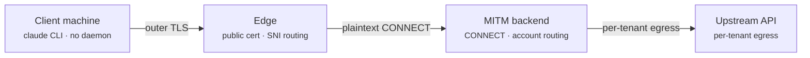

# Hosted service — requirements

Requirements for turning the local proxy into a multi-tenant hosted service.

Every architectural claim below is **measured**, not assumed: a real Claude Code process
was driven through a proxy and the handshakes and request paths were observed. Findings
are numbered `F01`–`F18` and referenced from the requirements that rest on them. What
could not be measured is recorded as open rather than filled in with a guess.

| | |
| --- | --- |
| Measured | 18 |
| Open | 2 — client platform coverage, see §8.4 |
| Backlog | 1 — egress IP, see §5 |
| Tracked as issues | [#3](../../issues/3)–[#9](../../issues/9) |
| Pull requests | [#1](../../pull/1), [#2](../../pull/2), [#10](../../pull/10) |

---

## 1. Scope

Each user registers **accounts they own** and uses them from their own machines. Accounts
are not shared between people. The proxy runs in the cloud and terminates MITM there.

The client carries **no resident process** — three files and one settings block. No agent,
no shell wrapper, no system trust-store installation. This was measured, not assumed.

| On the client | Role |
| --- | --- |
| `tenant-ca.pem` | Trusts the inner MITM leaf |
| `device.crt` / `device.key` | Device identity — per-machine auth and revocation |
| `~/.claude/settings.json` | `env` block holding the proxy URL and the paths above |

> **The outer TLS can use an ordinary public certificate.** When the edge terminates
> outer TLS with a publicly-trusted certificate, the device certificate inside the CONNECT
> tunnel still reaches the backend (F08). So the only CA a client must be given is the
> **inner** one.

---

## 2. Measured findings

| ID | Question | Result | Environment |
| --- | --- | --- | --- |
| **F01** | Does the client present a certificate on the TLS handshake *inside* the CONNECT tunnel? | **Yes** — `CN=device-01` observed on `POST /v1/messages` | 2.1.223, 2.1.193 |
| **F02** | Is an `https://` scheme proxy URL supported? | **Yes** — outer TLS → CONNECT → inner TLS all succeed | 2.1.223, 2.1.193 |
| **F03** | What actually causes the reported `https://` proxy failure? | **Misdiagnosis** — not TLS-in-TLS; the proxy certificate lacked the connect hostname in its SAN | Windows |
| **F04** | Can the proxy be configured purely from the `env` block of `settings.json`? | **Yes** — no shell variables, no wrapper | project scope |
| **F05** | Can 100% of traffic be captured from `settings.json` alone? | **No** — one `/api/eval/*` request fires before settings load and bypasses the proxy. Superseded by F14 | isolated by experiment |
| **F06** | Does mTLS coverage vary by client version? | **Yes** — 2.1.193 omits it on bootstrap paths, but **both** versions send it on `/v1/messages` | 2.1.223 vs 2.1.193 |
| **F07** | Cost of an nginx `stream` passthrough in front? | **None** — 5.00 s vs 5.01 s direct | Linux |
| **F08** | Does device mTLS survive an edge that terminates the outer TLS? | **Yes** — public cert at the edge, plaintext CONNECT to the backend, certificate still arrives | Linux, public path |
| **F09** | Is refusing a non-upstream CONNECT safe? | **For telemetry hosts, yes** — the client carried on. Does **not** extend to every host: `downloads.claude.ai` carries plugin and self-update traffic and was never part of that test | 2.1.223 |
| **F10** | How much traffic gets an account token injected today? | **Too much** — 8 of 12 observed paths, including account-scoped state | live capture |
| **F11** | Does Linux behave differently from Windows? | **No** — identical results | Ubuntu 24.04 |
| **F12** | Is the proxy→upstream leg the latency bottleneck? | **No** — the server leg was slightly faster than a local direct connection | TTFB |
| **F13** | Is remote operation already in scope for this project? | **Yes** — `proxy.host` + `proxy.apiKey` are already documented for off-box clients | code + docs |
| **F14** | Can 100% of traffic be captured at all? | **Yes** — shell env covers the pre-settings window, `settings.json` covers everything after. Both set: **9 of 9** observed paths | 2.1.223 |
| **F15** | Does shell env reach a background agent? | **Yes** — the supervisor cold-started from that shell inherits it; `/v1/messages` included | 2.1.223 |
| **F16** | Does a **project**-scope `settings.json` reach a background agent? | **No** — the agent ran to completion with **zero** proxy traffic. It went direct | 2.1.223 |
| **F17** | Does a **user**-scope `settings.json` reach a background agent? | **Yes** — 33 CONNECTs arrived, and none on the shell listener | 2.1.223 |
| **F18** | Does the upstream allow one account in concurrent sessions? | **Yes** — five concurrent sessions observed on one account, several mid-request | production use |

### What F14–F17 settle: how the client must be configured

F05 read as a trade-off between capture and authentication. Measuring the remaining
combinations dissolved it — the two injection methods cover **different windows**, so
setting both is strictly better than either.

| | Pre-settings window | After settings load | Background agents |
| --- | --- | --- | --- |
| Shell environment | ✅ | ✅ | ✅ (F15) |
| `settings.json`, **project** scope | ✗ | ✅ | ❌ **bypasses** (F16) |
| `settings.json`, **user** scope | ✗ | ✅ | ✅ (F17) |

**Requirement.** The enrollment script must write **both**:

1. `~/.claude/settings.json` — **user scope**. Project scope is not a weaker option, it is
   a silent hole: a background agent configured that way ran to completion having reached
   the upstream directly (F16).
2. A shell `export` — covers the window before settings are read.

Together: 9 of 9 observed paths captured (F14).

mTLS is enforced **on the rotation path**, not at the TLS layer — see §8.1.

---

## 3. Architecture

The load-bearing property is that the two TLS layers are independent (F08). The edge can
therefore be ordinary managed infrastructure, and device authentication still reaches the
backend.

- **Outer TLS** ends at the edge. It may also be passed straight through — both were
  measured and neither added overhead (F07, F08).
- **Inner MITM TLS plus the device certificate** runs from the client all the way to the
  backend, through whatever the edge does.
- **Only inference paths take a rotated account token.** Everything else travels on the
  client's own credential.

---

## 4. Requirements

### A — already present, reusable as-is

| Requirement | Existing implementation |
| --- | --- |
| Off-box binding | `proxy.host`, `TEAMCLAUDE_HOST` |
| Remote client auth | `proxy.apiKey` (`x-api-key`, `Proxy-Authorization`) |
| Egress IP pinning | `egress.pin`, `src/egress-guard.js` |
| Residential egress fallback | `sx.apiKey`, `sx.mode` |
| Quota tracking, rotation, retry | `src/account-manager.js` |
| Concurrency control | `stormRamp`, `admit`/`release` |
| Session affinity | `distributeSessions`, `src/session-tracker.js` |
| Model routing and blocking | `routes`, `blockedModels`, `modelMap` |
| Token refresh, 401 re-auth, 403 failover | `ensureTokenFresh`, `forwardRequest` |
| MITM CA and leaf issuance | `src/mitm.js`, `src/x509.js` |

### B — present but needs changing for hosted use

| Item | Today | Needed | Tracked |
| --- | --- | --- | --- |
| Config store | one file, process-wide lock | per-tenant store, distributed lock | [#4](../../issues/4) |
| `AccountManager` | a single instance | per-tenant instance and lifecycle | [#4](../../issues/4) |
| CA | one global chain, **CA key discarded** | per-tenant, key in a KMS | [#5](../../issues/5) |
| Path classification | 3 exceptions, everything else rotates | only inference rotates | [PR #2](../../pull/2) |
| CONNECT targets | blind tunnel by default | upstream host allowlist | [#8](../../issues/8) |
| Test-host intercept | answers for a real public domain | remove | [#8](../../issues/8) |
| Loopback auth exemption | always exempt | must be disableable | [#8](../../issues/8) |
| TUI | inside the server process | separate web dashboard | — |

### C — does not exist yet

| Item | Note | Tracked |
| --- | --- | --- |
| TLS on the proxy listener | without it the off-box mode sends the proxy key in clear | [PR #1](../../pull/1) |
| mTLS device authentication | behavior already measured (F01, F08); only implementation remains | [#6](../../issues/6) |
| Multi-tenancy | there is no tenant concept in the code at all | [#4](../../issues/4) |
| Hosted OAuth enrollment | the current flow is localhost-callback only | [#7](../../issues/7) |
| Token-invalidation detection and re-auth | locally one `login`; hosted it is a dashboard round trip | [#7](../../issues/7) |
| Signup, billing, dashboard | the whole control plane | — |

---

## 5. Open items

### OAuth `redirect_uri` policy — [#7](../../issues/7)

Whether a hosted callback URI is accepted is unconfirmed. An unauthenticated probe cannot
answer it: bot protection returns the same refusal for every value, including the
localhost baseline that is known to work. It needs a real browser session.

Low priority — the paste-the-code flow works either way, so this only decides whether the
dashboard can offer a smoother redirect.

### Backlog — egress IP treatment — [#3](../../issues/3)

How the upstream treats the **source IP** of a request. Locally that is one consumer line
carrying one person's accounts; hosted, it becomes a datacenter address carrying several
people's accounts. `docs/proxy-modes.md` notes that some limits key on the outbound IP
rather than the account, which is what makes it a question at all.

**Deliberately out of scope for the build.** Three reasons:

1. **Nothing is built from the answer.** The mitigations already exist — `egress.pin`
   holds a request rather than sending it from an unexpected address, and
   `sx.mode: "429"` retries through a different egress. A bad result turns a config flag
   on; it does not change the architecture.
2. **No design depends on it.** Every architectural question is settled by F01–F13.
3. **A complete answer is not obtainable yet.** A cheap check — point `upstreamProxy` at
   a proxy on a cloud host and keep using the existing setup — only exercises *one
   person's* accounts behind one address. The concern is *several people's* accounts
   sharing one, which cannot be observed before real multi-tenant traffic exists. So it
   cannot be a prerequisite for the work that produces that traffic.

Revisit as a deployment checklist item: set `upstreamProxy`, use it normally, and watch
whether rotation still clears a limit.

---

## 6. Order of work

The order matters: each step is either a prerequisite for the next, or its result changes
the next one's design.

| Phase | Work | Gate |
| --- | --- | --- |
| **P0** | TLS listener and rotation scope. Both fix defects in the current product independently of any hosting plan. | [#1](../../pull/1), [#2](../../pull/2) — merged |
| **P1** | Dismantle single-tenancy: config store to a database, per-tenant `AccountManager`, distributed locking. Most later work is blocked on this. | [#4](../../issues/4) |
| **P2** | Security boundary: per-tenant CA and key custody, mTLS device auth, hosted hardening. | [#5](../../issues/5), [#6](../../issues/6), [#8](../../issues/8) — security review |
| **P3** | Control plane: signup, OAuth enrollment, re-auth flow, dashboard, billing, per-tenant observability. | [#7](../../issues/7) |
| **P4** | Rewrite the compliance documentation. | release gate — legal review advised |

[§8](#8-to-settle-before-building) tracks what was settled before P1 and the two client
coverage gaps that remain open. Neither blocks P1.

On P4: [`docs/compliance.md`](compliance.md) currently states the project is *"a
self-hosted local proxy… **not** a hosted service"* that *"never routes requests on behalf
of third parties"*. All three claims invert, so the page needs rewriting rather than
amending.

---

## 7. Data protection

Terminating TLS in the cloud means **every prompt and every piece of source code exists in
plaintext in server memory**. The request body is buffered in full so it can be replayed
on another account, so this cannot be avoided.

| Item | Requirement |
| --- | --- |
| Request logging | Off by default. When on: per-tenant encryption, short retention, automatic deletion |
| Memory | Discard buffers immediately after the response; disable core dumps |
| Crash and error reporting | Must not capture request bodies |
| Token storage | Envelope encryption — currently plaintext JSON at `0600` |
| Legal | Privacy policy, processor disclosure, DPA |
| Background features | Keep-warm and the quota probe are **not offered** in a hosted product — an always-on server making them on its own reads as unattended automation |

> **Credential custody.** Because each user only ever uses their own accounts, account
> sharing does not arise. What is genuinely unsettled is how uploading one's own refresh
> token to a service is read under the terms. Mitigate with a self-hostable distribution,
> explicit consent, and access audit logging — and **get legal review.**

---

## 8. To settle before building

### 8.1 mTLS enforcement point — settled

Enforce mTLS **on the rotation path**, not at the TLS layer.

Both work on a current client (F14, F17). The rotation path is the durable one:
TLS-layer enforcement fails closed for *every* request the moment a release changes which
paths carry a certificate, and F03 and F06 both found behaviour moving between releases in
exactly this area. Per-request enforcement degrades instead of locking everyone out, and
it is the check that matters — the rotation path is the only one that spends an account.

Unblocks [#6](../../issues/6).

### 8.2 Verification loop — done

Fixed in [#12](../../pull/12): the tests no longer inherit ambient `HTTP(S)_PROXY`, and
the suite carries a per-test timeout. CI is green on Linux across Node 20, 22 and 24, and
runs automatically on push and pull request.

### 8.3 Compliance documentation — done

Scoped to the local proxy in [#13](../../pull/13), pointing here. The full rewrite stays
release-gate work (P4) and wants legal review.

### 8.4 Enforce a minimum client version — open

Supporting only current clients is a deliberate decision. In a hosted product users
install their own client, so "we only run the latest" is not something the operator
observes — it has to be **enforced**, or an old client silently gets a worse contract than
the design assumes.

| Requirement | Note |
| --- | --- |
| Minimum supported version, published | Below it, refuse with an error naming the version and how to update |
| Detect the client version per request | The user agent is the obvious carrier; confirm it reaches the rotation path |
| Version canary before adopting a release | A release that changes which paths carry a device certificate, or how a proxy URL is honoured, must be caught before users hit it |

The canary is the durable half. Pinning to "latest" trades an old-client problem for a
new-client one: the client can change under the service at any time, so the measurements
here have a shelf life.

Not yet tracked as an issue.

### 8.5 Client platform coverage — open

The thin-client claim (§1) is measured on **Windows and Linux**, in `-p` and background
modes (F01–F04, F08, F14–F17). Two axes remain, both needing a machine or terminal this
work did not have:

- **macOS** — the harness is directly reusable; an afternoon, not a project
- **Interactive mode** — every run was `-p` or `--bg`; request patterns may differ

Either could add a client requirement. Neither can change the architecture.

### 8.6 Corporate proxy — a limitation, not a gap

A client behind an **explicit** corporate proxy cannot use a hosted MITM proxy.
`HTTPS_PROXY` holds one value, and Claude Code has no proxy-chaining setting, so a user
who must traverse a corporate proxy to reach the internet has nowhere to put ours.
Transparent, network-level corporate proxies are unaffected.

The reverse direction — teamclaude itself reaching upstream through another proxy — is
already supported and covered by the existing `upstream-proxy` tests.

Record this as a documented limitation rather than something to solve.

---

## 9. Appendix

### Reproducing the measurements

Stand up a dummy MITM proxy, drive Claude Code through it, and observe the handshakes and
request paths. Nothing is forwarded upstream — the intercepted request is answered
locally, so this consumes no quota and needs no real credentials.

1. Generate a CA, a leaf and a device certificate. The leaf's SAN must contain **both the
   upstream hostname and the hostname used to reach the proxy** (F03).
2. Terminate CONNECT with a TLS server configured `requestCert: true`,
   `rejectUnauthorized: false` — the goal is to *observe*, not to enforce.
3. On `secureConnection`, record `getPeerCertificate()`.
4. Point the client at the proxy with the CA and device certificate, and make one request.

Repeat across the environment axes: client version, injection method (shell vs
`settings.json`), OS, and edge configuration (direct / TCP passthrough / TLS termination).

### Traps found while measuring

- **Certificate SAN.** If the hostname used to reach the proxy is absent from the SAN, the
  connection fails in a way that is indistinguishable from "protocol unsupported". A
  public issue appears to have misdiagnosed exactly this (F03).
- **Double TLS termination.** If the edge and the backend both terminate TLS, the backend
  reads a plaintext CONNECT as a TLS record and fails. When the edge terminates, the
  backend must be a plaintext listener.
- **Ambient proxy variables.** Running the test suite with proxy environment variables set
  produces unrelated failures. This affects the repository's existing tests too
  ([#9](../../issues/9)).

### Axes not measured

- macOS — the harness is directly reusable
- Interactive mode — every run was `-p` or `--bg`; request patterns may differ

Both are §8.5. Everything else once listed here has since been measured or resolved:
background agents (F15–F17), concurrent sessions on one account (F18), and corporate
proxy nesting (§8.6, a limitation rather than an open question).

### Findings resting on a single observation

Recorded so they are not mistaken for the multi-environment results above:

- **F09** — refusing *telemetry* CONNECTs was observed safe on one `-p` run. It does not
  generalise: `downloads.claude.ai` carries plugin and self-update traffic, and a
  background agent reaches for it. The allowlist in [#8](../../issues/8) has to be
  composed from what the client actually needs, not assumed from this one result.
- **F12** — latency was compared on one network path. Useful as a direction, not a number
  to plan capacity from.
